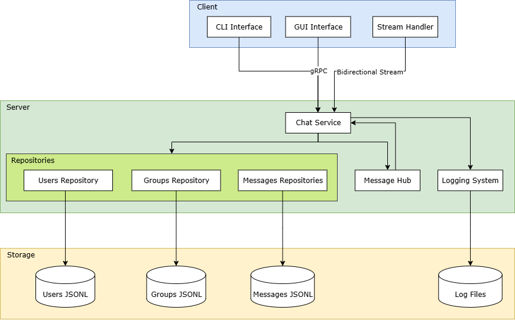
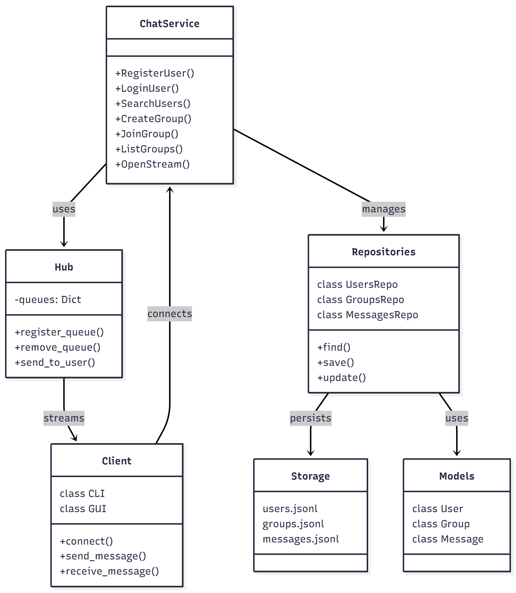
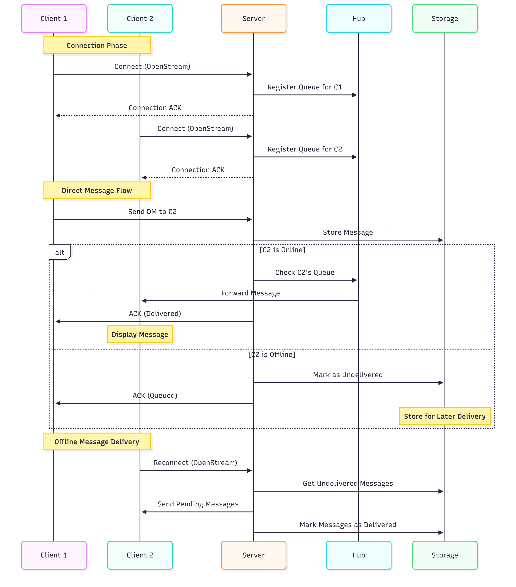
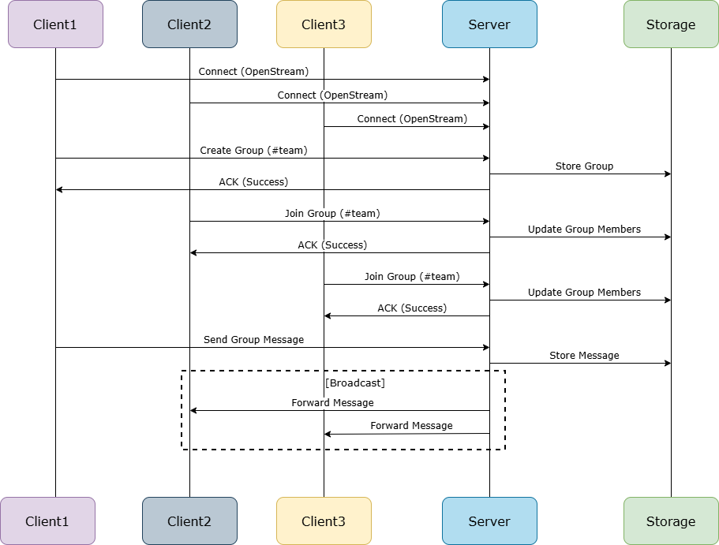

# Chuyên đề hệ thống phân tán - 22MMT
# Đồ án môn học: Ứng dụng Chat sử dụng gRPC

## Thông tin thành viên: 
- **22127416 - Nguyễn Quốc Tín**
- **22127422 - Lê Thanh Minh Trí**

## 1. Mô tả đồ án

### 1.1. Mục tiêu
Xây dựng ứng dụng chat cho phép nhiều người dùng giao tiếp với nhau thông qua:
- Chat 1-1 (Direct Message)
- Chat nhóm (Group Chat)
- Hỗ trợ tin nhắn offline

### 1.2. Công nghệ sử dụng
- **Python 3.8+**: Ngôn ngữ lập trình chính
- **gRPC**: Framework giao tiếp giữa client-server
- **Protocol Buffers**: Định nghĩa cấu trúc dữ liệu và service
- **asyncio**: Xử lý bất đồng bộ trong Python
- **JSONL**: Format lưu trữ dữ liệu

### 1.3. Chức năng cốt lõi
- Đăng ký/Đăng nhập người dùng
- Gửi tin nhắn trực tiếp (1-1)
- Tạo và tham gia nhóm chat
- Gửi tin nhắn nhóm (broadcast)
- Lưu trữ và gửi lại tin nhắn offline
- Hỗ trợ cả giao diện CLI và GUI

## 2. Tính năng chi tiết

### 2.1. Quản lý người dùng
- Đăng ký tài khoản với display name
- Đăng nhập với display name đã đăng ký
- Tìm kiếm người dùng trong hệ thống
- Hiển thị danh sách người dùng

### 2.2. Chat 1-1 (Direct Message)
- Gửi tin nhắn trực tiếp đến một người dùng cụ thể
- Nhận thông báo về trạng thái gửi tin (delivered/queued)
- Xem lịch sử chat với từng người
- Nhận tin nhắn real-time khi online

### 2.3. Chat nhóm (Group Chat)
- Tạo nhóm chat mới
- Tham gia vào nhóm hiện có
- Gửi tin nhắn đến tất cả thành viên trong nhóm
- Xem danh sách nhóm và thành viên (list các thành viên trong nhóm chỉ hỗ trợ CLI)
- Broadcast tin nhắn đến tất cả thành viên online

### 2.4. Xử lý tin nhắn offline
- Lưu trữ tin nhắn khi người nhận offline
- Tự động gửi lại tin nhắn khi người nhận online (chỉ gửi tin nhắn cho các nhóm mà user là thành viên)
- Kiểm tra tư cách thành viên nhóm trước khi gửi tin nhắn offline
- Đánh dấu trạng thái đã gửi cho tin nhắn
- Đồng bộ tin nhắn giữa các thiết bị

### 2.5. Trạng thái Tin nhắn (ACK):
- Mỗi tin nhắn gửi đi đều nhận được xác nhận (ACK).
+ "Delivered" (Đã gửi): Nếu người nhận đang online và nhận được tin.
+ "Queued" (Đang chờ): Nếu người nhận offline và tin nhắn đã được lưu trên server.

### 2.6. Giao diện Kép (CLI & GUI):
- Cung cấp giao diện dòng lệnh (CLI) cho các thao tác nhanh.
- Cung cấp giao diện đồ họa (GUI) trực quan, dễ sử dụng (khuyến nghị).

### 2.7. Lưu trữ bền bỉ:
Toàn bộ dữ liệu người dùng, nhóm, và lịch sử tin nhắn được lưu vào các file .jsonl trong thư mục **data/** và được tải lại khi server khởi động.

## 3. Yêu cầu cài đặt

### 3.1. Yêu cầu hệ thống
- Python 3.8 trở lên
- pip (Python package installer)

### 3.2. Thư viện Python cần thiết
```bash
pip install -r requirements.txt
```
Nội dung file requirements.txt:
```
grpcio==1.54.0
grpcio-tools==1.54.0
protobuf==4.22.3
typer==0.9.0
```

### 3.3. Compile file Protocol Buffers
```bash
python -m grpc_tools.protoc -I./chatapp/proto --python_out=./chatapp/proto --grpc_python_out=./chatapp/proto ./chatapp/proto/chat.proto
```

## 4. Hướng dẫn chạy chương trình

### 4.1. Khởi động Server
```bash
python -m chatapp.server.main
```
Server sẽ lắng nghe tại địa chỉ `localhost:50051` (có thể chỉnh sửa lại host và port trong /server/main.py)

### 4.2. Chạy Client CLI
```bash
# Đăng ký người dùng mới
python -m chatapp.client.cli --name "UserName"

# Đăng nhập với tài khoản có sẵn
python -m chatapp.client.cli --name "UserName"
```

Các lệnh có sẵn trong CLI:
- `/search <query>`: Tìm kiếm người dùng
- `/dm @user message`: Gửi tin nhắn trực tiếp
- `/create-group #name`: Tạo nhóm mới
- `/join-group #name`: Tham gia nhóm
- `/group #name message`: Gửi tin nhắn nhóm
- `/list-groups`: Xem danh sách nhóm và thành viên
- `/help`: Hiển thị trợ giúp

### 4.3. Chạy Client GUI
```bash
python -m chatapp.client --mode gui
```

## 5. Kiến trúc hệ thống

### 5.1. Sơ đồ Hệ thống tổng quan


Hệ thống được chia thành 3 tầng chính:

1. **Tầng Client**:
   - Cung cấp giao diện người dùng (CLI/GUI)
   - Stream Handler để xử lý luồng gRPC bất đồng bộ
   - Xử lý input/output
   - Duy trì kết nối với server qua gRPC

2. **Tầng Server**:
   - ChatService: Xử lý các request từ client
   - Message Hub: Quản lý và điều phối tin nhắn
   - Repositories: Truy xuất và lưu trữ dữ liệu
   - Logging System: Ghi log hoạt động

3. **Tầng Storage**:
   - Lưu trữ dữ liệu dạng JSONL
   - Quản lý users, groups, messages riêng biệt
   - Hỗ trợ persistence và recovery

### 5.2. Sơ đồ Kiến trúc Thành phần


Các thành phần chính và mối quan hệ:

1. **ChatService**:
   - Implement gRPC service interface
   - Xử lý request từ client
   - Điều phối giữa Hub và Repositories

2. **Hub**:
   - Quản lý kết nối real-time
   - Maintain message queues cho mỗi user
   - Xử lý việc gửi/nhận tin nhắn

3. **Repositories**:
   - Sử dụng Models để định nghĩa cấu trúc dữ liệu (User, Group, Message)
   - UsersRepo: Quản lý thông tin người dùng
   - GroupsRepo: Quản lý nhóm và thành viên
   - MessagesRepo: Lưu trữ và truy xuất tin nhắn

4. **Client**:
   - Kết nối với ChatService qua gRPC
   - Xử lý luồng tin nhắn hai chiều
   - Hiển thị thông tin cho người dùng

## 6. Luồng hoạt động

### 6.1. Sơ đồ tuần tự Chat 1-1


Luồng chat 1-1 bao gồm:

1. **Giai đoạn kết nối**:
   - Client kết nối với server qua OpenStream
   - Server đăng ký queue cho client
   - Gửi ACK xác nhận kết nối

2. **Luồng tin nhắn trực tiếp**:
   - Client A gửi tin nhắn đến server
   - Server lưu tin nhắn vào database
   - Kiểm tra trạng thái online của Client B
        + Trường hợp [B is Online]:
            1. Server Check B's Queue (trong Hub) và thấy B đang online.
            2. Server Forward Message tin nhắn qua stream của B.
            3. Server gửi ACK (Delivered) về cho A.
        + Trường hợp [B is Offline]:
            1. Server kiểm tra Hub và không thấy queue của B.
            2. Server Mark as Undelivered trong tin nhắn đã lưu ở Storage.
            3. Server gửi ACK (Queued) về cho A (báo rằng tin đã được lưu và sẽ gửi sau).

3. **Xử lý tin nhắn offline**:
   - Server lưu tin nhắn cho client offline
   - Khi client online lại, gửi các tin chưa đọc
   - Cập nhật trạng thái đã gửi

### 6.2. Luồng chat nhóm


Luồng chat nhóm bao gồm:
1. **Kết nối:** Cả 3 Client (C1, C2, C3) đều **Connect(OpenStream)** tới Server.

1. **Tạo nhóm**:
   - Client C1 gửi request tạo nhóm ***Create Group (#team)***
   - Server tạo nhóm và lưu thông tin (lưu nhóm mới và thêm C1 làm thành viên) vào ***Storage***.
   - Trả về kết quả cho client (***ACK (Success)*** về cho C1.)

2. **Tham gia nhóm**:
   - Client C2, C3 gửi request ***Join Group (#team)***.
   - Server kiểm tra và thêm C2, C3 vào nhóm 
   - Cập nhật danh sách thành viên (***Update Group Members***)

3. **Gửi tin nhắn nhóm**:
   - Client C1 gửi tin nhắn đến server **Send Group Message** (target là ***#team***).
   - Server ***Store Message*** (lưu tin nhắn nhóm).
   - Server ***broadcast*** đến tất cả thành viên online:
        1. Server lấy danh sách thành viên của ***#team*** (gồm C1, C2, C3).
        2. Server kiểm tra xem ai đang online (ở đây là C2 và C3).
        3. Server Forward Message tin nhắn đó đến stream của C2 và C3.
   - Queue tin nhắn cho thành viên offline
   - Gửi **ACK về số người đã nhận**

## 7. Cấu trúc thư mục dự án
```
DSProject/
├── chatapp/
│   ├── client/
│   │   ├── cli.py         # Command-line interface
│   │   └── gui.py         # Graphical interface
│   ├── proto/
│   │   ├── chat.proto     # Protocol definition
│   │   └── chat_pb2*.py   # Generated code
│   ├── server/
│   │   ├── hub.py         # Message routing
│   │   ├── models.py      # Data models
│   │   ├── repo.py        # Data access
│   │   └── service.py     # gRPC implementation
│   ├── utils/
│   │   └── logger.py      # Logging configuration
│   └── data/
│       ├── users.jsonl    # User data
│       ├── groups.jsonl   # Group data
│       └── messages.jsonl # Message history
├── docs/
├── diagrams/
└── logs/
```

## 8. Hệ thống Logging

### 8.1. Cấu hình Log
- **Log Level**: DEBUG, INFO, WARNING, ERROR
- **Format**: `%(asctime)s - %(levelname)s - %(message)s`
- **Output**: Console và File

### 8.2. Các loại Log
1. **Connection Logs**:
   - Kết nối/ngắt kết nối của client
   - Đăng ký/đăng nhập người dùng

2. **Message Logs**:
   - Gửi/nhận tin nhắn
   - Trạng thái gửi tin nhắn
   - Queue/Dequeue tin nhắn

3. **Group Logs**:
   - Tạo/join nhóm
   - Broadcast tin nhắn
   - Thay đổi thành viên

4. **System Logs**:
   - Khởi động/dừng server
   - Lỗi hệ thống

### 8.3. Vị trí Log File
- Log files được lưu trong thư mục `/logs`
- Log chi tiết lưu trong file: `server.log`

### 8.4. Ví dụ Log
```log
2023-10-30 10:15:23 - INFO - Server started on port 50051
2023-10-30 10:15:45 - INFO - User 'Alice' registered successfully with ID 'u123'
2023-10-30 10:16:01 - DEBUG - ChatStream: User 'u123' connected to stream
2023-10-30 10:16:15 - INFO - Created group '#team' by user 'u123'
2023-10-30 10:16:30 - DEBUG - Broadcast group message to 'u456' status: delivered
```
